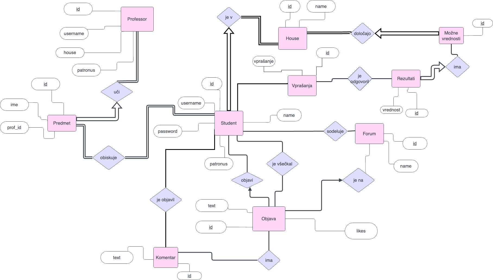

# OPB-projekt
To je repozitorij za projekt pri predmetu Osnove podatkovnih baz. Naredili bova aplikacijo, ki bo predstavljala spletno učilnico Bradavičarke. Na začetku se bo uporabnik lahko vpisal na Bradavičarko in na osnovi kviza mu bo dodeljena hiša. Glede na hišo boš dobil predmete in profesorje. Nato boš lahko objavljal na forum in komentiral objave drugih učencev. Na podlagi všečkov na objavi bo vsaka hiša zbirala točke in hiša z največ točkami na koncu šolskega leta dobi 'House cup'.
